# Rancher RKE2 Cluster


## 參考資料

https://docs.rke2.io/#how-is-this-different-from-rke-or-k3s

## RKE2 vs REK vs K3S

RKE2 combines the best-of-both-worlds from the 1.x version of RKE (hereafter referred to as RKE1) and K3s.

From K3s, it inherits the usability, ease-of-operations, and deployment model.

From RKE1, it inherits close alignment with upstream Kubernetes. In  places K3s has diverged from upstream Kubernetes in order to optimize  for edge deployments, but RKE1 and RKE2 can stay closely aligned with  upstream.

Importantly, RKE2 does not rely on Docker as RKE1 does. RKE1  leveraged Docker for deploying and managing the control plane components as well as the container runtime for Kubernetes. RKE2 launches control  plane components as static pods, managed by the kubelet. The embedded  container runtime is containerd.

## 架構

devop/suse

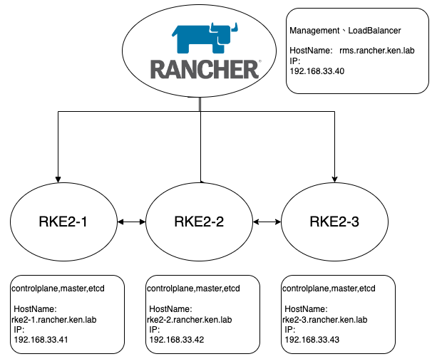

DownStream K8S

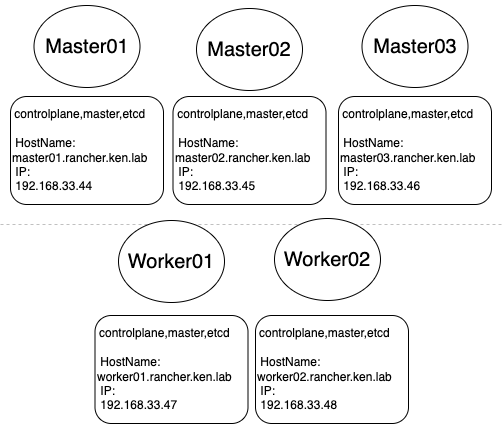

## 安裝作業系統 (No Swap)

關閉防火牆

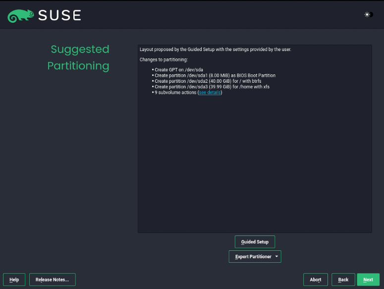

## 註冊作業系統

```
yast2
email: ken.wang@infotech.com.tw
Registry Code: B8203D65240BDA3A
```

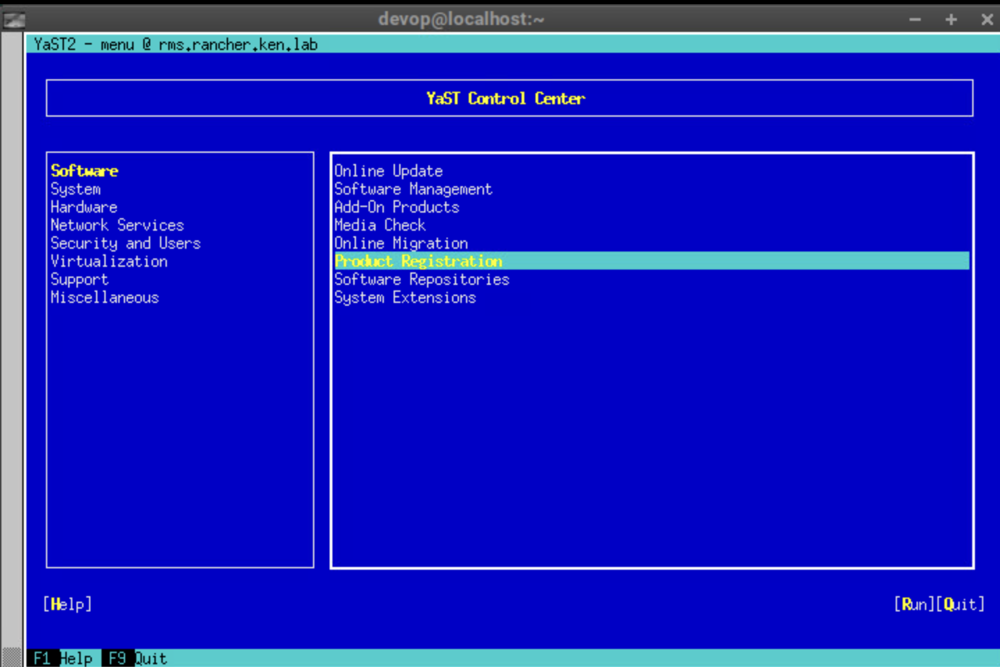

## 安裝RMS

https://kb.vmware.com/s/article/57122

### 安裝DNS Server

```
devop@rms:~> sudo zypper install -t pattern dhcp_dns_server
[sudo] root 的密碼：
devop@rms:~> sudo yast2
```

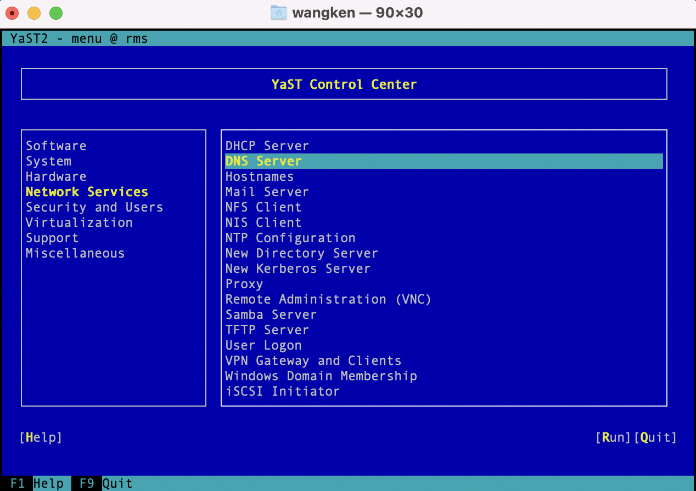

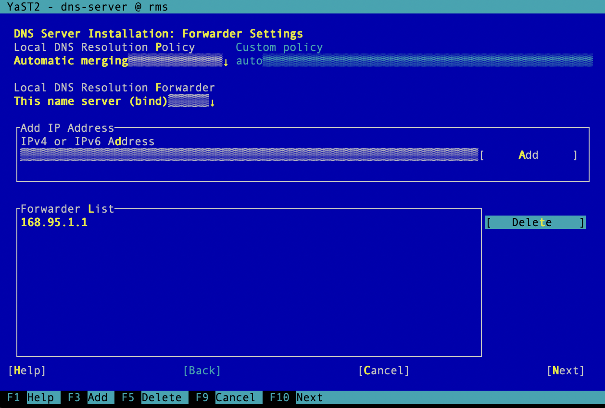

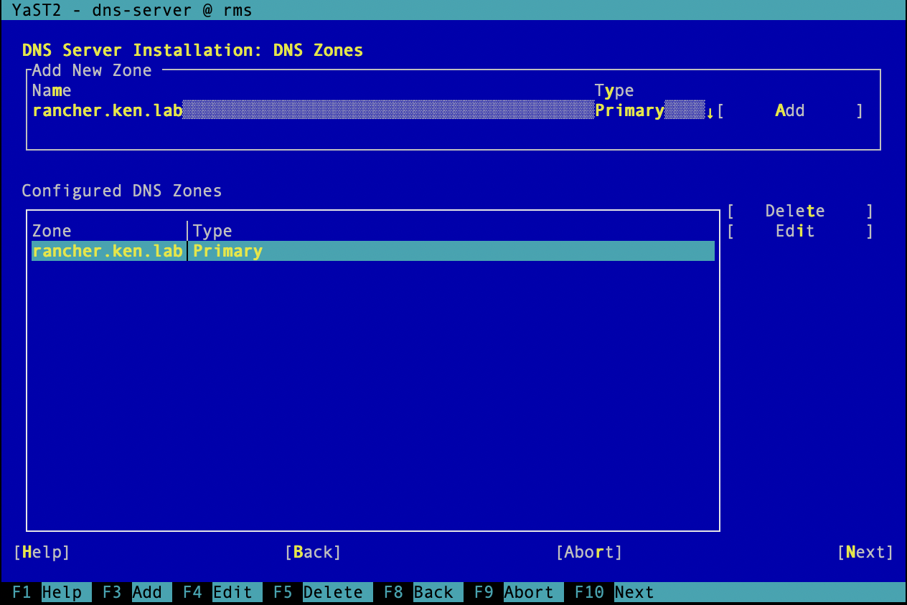

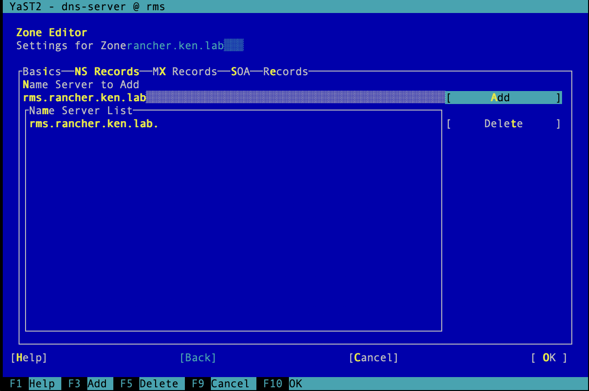

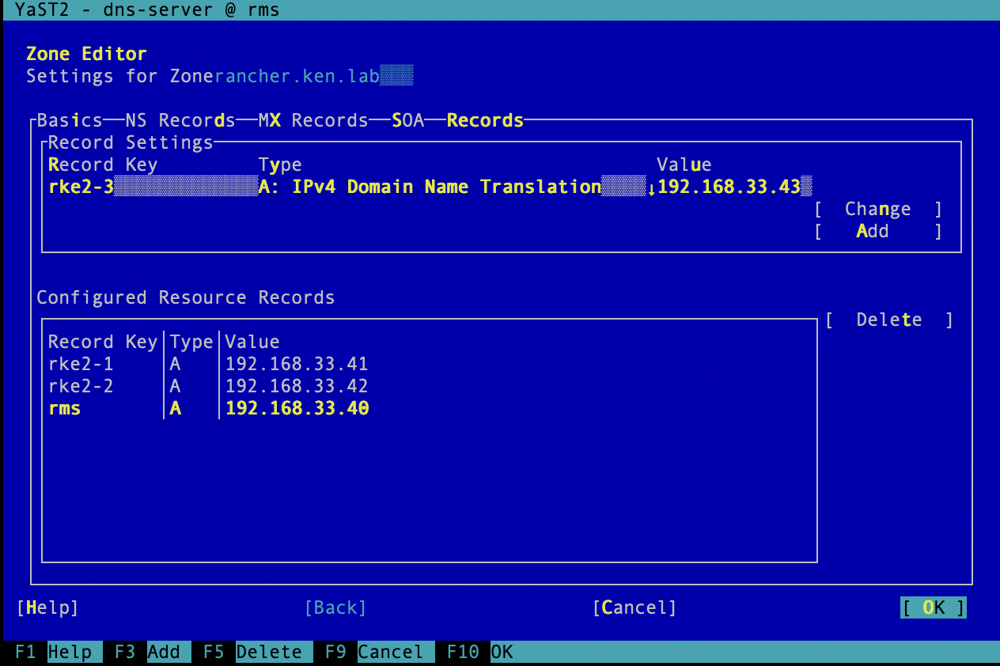

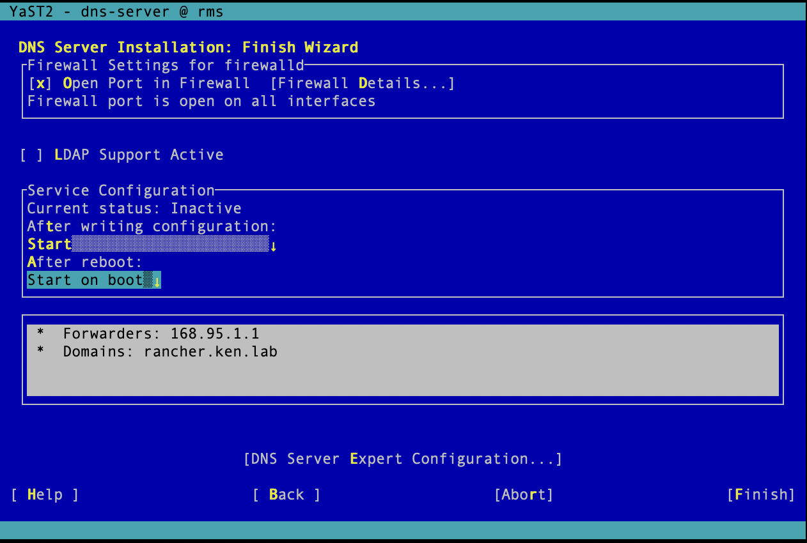

### 安裝Ngnix

1. 安裝nginx

   ```
   devop@rms:~> sudo zypper install nginx
   [sudo] root 的密碼：
   正在重新整理服務 'Basesystem_Module_15_SP4_x86_64'。
   正在重新整理服務 'Desktop_Applications_Module_15_SP4_x86_64'。
   正在重新整理服務 'SUSE_Linux_Enterprise_Server_15_SP4_x86_64'。
   正在重新整理服務 'Server_Applications_Module_15_SP4_x86_64'。
   正在載入套件庫資料...
   正在讀取已安裝的套件...
   正在解決套件相依性...
   
   將會安裝下列 1 個新的套件：
     nginx
   
   1 要安裝的新套件.
   全部下載大小：702.9 KiB。已快取：0 B。 完成操作後，將使用額外的 2.3 MiB。
   要繼續嗎？ [y/n/v/...? 顯示所有選項] (y): y
   正在取出 套件 nginx-1.21.5-150400.1.8.x86_64           (1/1), 702.9 KiB (已解開   2.3 MiB)
   正在取回︰ nginx-1.21.5-150400.1.8.x86_64.rpm ......................................[完成]
   
   正在檢查檔案衝突： .................................................................[完成]
   /usr/sbin/useradd -r -c User for nginx -d /var/lib/nginx -U nginx -s /usr/sbin/nologin
   (1/1) 正在安裝：nginx-1.21.5-150400.1.8.x86_64 .....................................[完成]
   
   ```

2. 設定ngnix

   ```
   devop@rms:/etc/nginx> sudo cat /etc/nginx/nginx.conf
   worker_processes 4;
   worker_rlimit_nofile 40000;
   
   
   load_module lib64/nginx/modules/ngx_stream_module.so;
   
   events {
       worker_connections 8192;
   }
   
   #http {
   #    server {
   #        listen         80;
   #        return 301 https://$host$request_uri;
   #    }
   #}
   
   stream {
       upstream rancher_servers_http {
           least_conn;
           server 192.168.33.41:80 max_fails=3 fail_timeout=5s;
           server 192.168.33.42:80 max_fails=3 fail_timeout=5s;
           server 192.168.33.43:80 max_fails=3 fail_timeout=5s;
       }
   
           #後端web server
       server {
   	    listen 80;
   	    proxy_pass rancher_servers_http;
       }
   
       upstream rancher_servers_https {
   	    least_conn;
               server 192.168.33.41:443 max_fails=3 fail_timeout=5s;
               server 192.168.33.42:443 max_fails=3 fail_timeout=5s;
               server 192.168.33.43:443 max_fails=3 fail_timeout=5s;
       }
       server {
   	    listen 443;
   	    proxy_pass rancher_servers_https;
       }
           upstream rancher_servers_6443 {
               least_conn;
               server 192.168.33.41:6443 max_fails=3 fail_timeout=5s;
               server 192.168.33.42:6443 max_fails=3 fail_timeout=5s;
               server 192.168.33.43:6443 max_fails=3 fail_timeout=5s;
       }
       server {
               listen 6443;
               proxy_pass rancher_servers_6443;
       }
       upstream rancher_servers_9345 {
               least_conn;
               server 192.168.33.41:9345 max_fails=3 fail_timeout=5s;
               server 192.168.33.42:9345 max_fails=3 fail_timeout=5s;
               server 192.168.33.43:9345 max_fails=3 fail_timeout=5s;
       }
       server {
               listen 9345;
               proxy_pass rancher_servers_9345;
       }
   	    
       log_format basic '$remote_addr [$time_local] '
                        '$protocol $status $bytes_sent $bytes_received '
                        '$session_time "$upstream_addr" '
                        '"$upstream_bytes_sent" "$upstream_bytes_received" "$upstream_connect_time"';
   
       access_log /var/log/nginx/access.log basic;
       error_log /var/log/nginx/error.log;
   
       
   }
   
   ```

3. 啟動服務

   ```
   devop@rms:/etc/nginx> sudo nginx -t
   nginx: the configuration file /etc/nginx/nginx.conf syntax is ok
   nginx: configuration file /etc/nginx/nginx.conf test is successful
   
   devop@rms:/etc/nginx> sudo systemctl enable nginx --now
   Created symlink /etc/systemd/system/multi-user.target.wants/nginx.service → /usr/lib/systemd/system/nginx.service.
   ```

### 調整防火牆設定

```
devop@rms:/etc/nginx> sudo firewall-cmd --add-port=80/tcp --permanent
success
devop@rms:/etc/nginx> sudo firewall-cmd --add-port=443/tcp --permanent
success
devop@rms:/etc/nginx> sudo firewall-cmd --add-port=6443/tcp --permanent
success
devop@rms:/etc/nginx> sudo firewall-cmd --add-port=9345/tcp --permanent
success
devop@rms:/etc/nginx> sudo firewall-cmd --reload 
success
```

```
Inbound Rules for RKE2 Server Nodes
Protocol	Port	Source	Description
TCP	9345	RKE2 agent nodes	Kubernetes API
TCP	6443	RKE2 agent nodes	Kubernetes API
UDP	8472	RKE2 server and agent nodes	Required only for Flannel VXLAN
TCP	10250	RKE2 server and agent nodes	kubelet
TCP	2379	RKE2 server nodes	etcd client port
TCP	2380	RKE2 server nodes	etcd peer port
TCP	30000-32767	RKE2 server and agent nodes	NodePort port range
UDP	8472	RKE2 server and agent nodes	Cilium CNI VXLAN
TCP	4240	RKE2 server and agent nodes	Cilium CNI health checks
ICMP	8/0	RKE2 server and agent nodes	Cilium CNI health checks
TCP	179	RKE2 server and agent nodes	Calico CNI with BGP
UDP	4789	RKE2 server and agent nodes	Calico CNI with VXLAN
TCP	5473	RKE2 server and agent nodes	Calico CNI with Typha
TCP	9098	RKE2 server and agent nodes	Calico Typha health checks
TCP	9099	RKE2 server and agent nodes	Calico health checks
TCP	5473	RKE2 server and agent nodes	Calico CNI with Typha
UDP	8472	RKE2 server and agent nodes	Canal CNI with VXLAN
TCP	9099	RKE2 server and agent nodes	Canal CNI health checks
UDP	51820	RKE2 server and agent nodes	Canal CNI with WireGuard IPv4
UDP	51821	RKE2 server and agent nodes	Canal CNI with WireGuard IPv6/dual-stack
```

用ansible來執行開啟port (針對各個nodes)

```
wangken@wangken-MAC aps-rancher % cat inventory 
[rke2-cluster]
192.168.2.[71:73] ansible_ssh_pass=P@55w.rd

[downstream]
192.168.2.[74:78] ansible_ssh_pass=P@55w.rd

wangken@wangken-MAC aps-rancher % cat ansible.cfg 
[defaults]
inventory = /Users/wangken/ansible/infoserver/aps-rancher/inventory
remote_user = devop
sudo_user = root
host_key_checking = False

[privilege_escalation]
become = true
become_user = root
become_ask_pass = true


wangken@wangken-MAC aps-rancher % cat firewall.yml 
---
- hosts: rke2-cluster
  tasks:
    - name:
      firewalld:
        port: "{{ item }}"
        permanent: yes
        immediate: yes
        state: enabled
      with_items:
       - 9345/tcp
       - 6443/tcp
       - 8472/udp
       - 10250/tcp
       - 2379-2380/tcp
       - 30000-32767/tcp
       - 8472/udp
       - 4240/tcp
       - 179/tcp
       - 4789/udp
       - 5473/tcp
       - 9098/tcp
       - 9099/tcp
       - 8472/udp
       - 51820/udp
       - 51821/udp
 wangken@wangken-MAC aps-rancher % ansible-playbook firewall.yml
 TASK [firewalld] ***************************************************************
changed: [192.168.2.73] => (item=9345/tcp)
changed: [192.168.2.72] => (item=9345/tcp)
changed: [192.168.2.71] => (item=9345/tcp)
changed: [192.168.2.72] => (item=6443/tcp)
changed: [192.168.2.73] => (item=6443/tcp)
changed: [192.168.2.71] => (item=6443/tcp)
changed: [192.168.2.73] => (item=8472/udp)
changed: [192.168.2.72] => (item=8472/udp)
changed: [192.168.2.71] => (item=8472/udp)
changed: [192.168.2.73] => (item=10250/tcp)
changed: [192.168.2.71] => (item=10250/tcp)
changed: [192.168.2.72] => (item=10250/tcp)
changed: [192.168.2.72] => (item=2379-2380/tcp)
changed: [192.168.2.73] => (item=2379-2380/tcp)
changed: [192.168.2.71] => (item=2379-2380/tcp)
changed: [192.168.2.71] => (item=30000-32767/tcp)
changed: [192.168.2.73] => (item=30000-32767/tcp)
changed: [192.168.2.72] => (item=30000-32767/tcp)

```


## 安裝RKE2-1

1. 安裝OS
2. 調整DNS 指向192.168.33.40
3. 關閉防火牆

### 安裝RKE2

1. 下載install.sh 

   ```
   devop@rke2-1:~> curl -sfL https://get.rke2.io --output install.sh
   devop@rke2-1:~> chmod +x install.sh
   ```

2. 新增設定檔

   ```
   devop@rke2-1:~> sudo mkdir -p /etc/rancher/rke2/
   [sudo] root 的密碼：
   devop@rke2-1:~> sudo vim /etc/rancher/rke2/config.yaml
   node-name:
     - "rke2-1"
   token: my-shared-secret
   tls-san:
     - rms.rancher.ken.lab
   ```

3. 安裝rke2 -- version 1.23.9

   ```
   devop@rke2-1:~> sudo INSTALL_RKE2_CHANNEL=v1.23.9+rke2r1 ./install.sh
   [WARN]  /usr/local is read-only or a mount point; installing to /opt/rke2
   [INFO]  finding release for channel v1.23.9+rke2r1
   [INFO]  using v1.23.9+rke2r1 as release
   [INFO]  downloading checksums at https://github.com/rancher/rke2/releases/download/v1.23.9+rke2r1/sha256sum-amd64.txt
   [INFO]  downloading tarball at https://github.com/rancher/rke2/releases/download/v1.23.9+rke2r1/rke2.linux-amd64.tar.gz
   [INFO]  verifying tarball
   [INFO]  unpacking tarball file to /opt/rke2
   [INFO]  updating tarball contents to reflect install path
   [INFO]  moving systemd units to /etc/systemd/system
   [INFO]  install complete; you may want to run:  export PATH=$PATH:/opt/rke2/bin
   --
   devop@rke2-1:~>  export PATH=$PATH:/opt/rke2/bin
   devop@rke2-1:~> sudo systemctl enable rke2-server --now
   Created symlink /etc/systemd/system/multi-user.target.wants/rke2-server.service → /etc/systemd/system/rke2-server.service.
   ```

   1. 調整kubectl 指令及kubeconfig >> 可把 kubectl、rke2.yaml  scp到 rms

   ```
   devop@rke2-1:~> mkdir .kube
   devop@rke2-1:~> sudo cp /etc/rancher/rke2/rke2.yaml .kube/config
   devop@rke2-1:~> sudo chown devop .kube/config 
   devop@rke2-1:~> sudo cp /var/lib/rancher/rke2/bin/kubectl /usr/local/bin/
   ----
   devop@rke2-1:~> sudo scp /etc/rancher/rke2/rke2.yaml devop@192.168.33.40:/home/devop/.kube/config
   The authenticity of host '192.168.33.40 (192.168.33.40)' can't be established.
   ECDSA key fingerprint is SHA256:NS1PCnKGGGiOsCVPSdoRDhX5jq0yhqhtEIr3pMNDSzw.
   Are you sure you want to continue connecting (yes/no/[fingerprint])? yes
   Warning: Permanently added '192.168.33.40' (ECDSA) to the list of known hosts.
   Password: 
   rke2.yaml                                                                100% 2969     2.6MB/s   00:00    
   devop@rke2-1:~> sudo scp /var/lib/rancher/rke2/bin/kubectl  root@192.168.33.40:/usr/local/bin
   Password: 
   kubectl                                                                  100%   47MB 220.3MB/s   00:00    
   ```

4. 確認pod status (切到 rms來操作)

   ```
   devop@rms:~> kubectl get pods -A
   NAMESPACE     NAME                                                    READY   STATUS      RESTARTS   AGE
   kube-system   cloud-controller-manager-rke2-1                         1/1     Running     0          5m46s
   kube-system   etcd-rke2-1                                             1/1     Running     0          5m30s
   kube-system   helm-install-rke2-canal-9pg26                           0/1     Completed   0          5m35s
   kube-system   helm-install-rke2-coredns-d4j4q                         0/1     Completed   0          5m35s
   kube-system   helm-install-rke2-ingress-nginx-gz7db                   0/1     Completed   0          5m35s
   kube-system   helm-install-rke2-metrics-server-fx65q                  0/1     Completed   0          5m35s
   kube-system   kube-apiserver-rke2-1                                   1/1     Running     0          5m21s
   kube-system   kube-controller-manager-rke2-1                          1/1     Running     0          5m47s
   kube-system   kube-proxy-rke2-1                                       1/1     Running     0          5m43s
   kube-system   kube-scheduler-rke2-1                                   1/1     Running     0          5m47s
   kube-system   rke2-canal-qkrdv                                        2/2     Running     0          5m19s
   kube-system   rke2-coredns-rke2-coredns-545d64676-2q6x9               1/1     Running     0          5m20s
   kube-system   rke2-coredns-rke2-coredns-autoscaler-5dd676f5c7-5bwdl   1/1     Running     0          5m20s
   kube-system   rke2-ingress-nginx-controller-gxp6v                     1/1     Running     0          4m42s
   kube-system   rke2-metrics-server-6564db4569-98ghm                    1/1     Running     0          4m53s
   devop@rms:~> 
   
   ```

5. 安裝Helm

   ```
   devop@rms:~> wget https://get.helm.sh/helm-v3.8.2-linux-amd64.tar.gz
   --2022-10-25 16:55:33--  https://get.helm.sh/helm-v3.8.2-linux-amd64.tar.gz
   Resolving get.helm.sh (get.helm.sh)... 152.199.39.108, 2606:2800:247:1cb7:261b:1f9c:2074:3c
   Connecting to get.helm.sh (get.helm.sh)|152.199.39.108|:443... connected.
   HTTP request sent, awaiting response... 200 OK
   Length: 13633605 (13M) [application/x-tar]
   Saving to: ‘helm-v3.8.2-linux-amd64.tar.gz’
   
   helm-v3.8.2-linux-amd64.ta 100%[=======================================>]  13.00M  34.4MB/s    in 0.4s    
   
   2022-10-25 16:55:35 (34.4 MB/s) - ‘helm-v3.8.2-linux-amd64.tar.gz’ saved [13633605/13633605]
   devop@rms:~> tar zxvf helm-v3.8.2-linux-amd64.tar.gz
   linux-amd64/
   linux-amd64/helm
   linux-amd64/LICENSE
   linux-amd64/README.md
   devop@rms:~> sudo cp linux-amd64/helm /usr/local/bin/
   [sudo] root 的密碼：
   devop@rms:~> helm version
   version.BuildInfo{Version:"v3.8.2", GitCommit:"6e3701edea09e5d55a8ca2aae03a68917630e91b", GitTreeState:"clean", GoVersion:"go1.17.5"}
   ```

### install rancher and cert-manager

1. Add helm repo & Install Cert-manager

   ```
   devop@rms:~> helm repo add rancher-stable https://releases.rancher.com/server-charts/stable
   "rancher-stable" has been added to your repositories
   devop@rms:~> kubectl create namespace cattle-system
   namespace/cattle-system created
   
   devop@rms:~> kubectl apply -f https://github.com/cert-manager/cert-manager/releases/download/v1.7.1/cert-manager.crds.yaml
   customresourcedefinition.apiextensions.k8s.io/certificaterequests.cert-manager.io created
   customresourcedefinition.apiextensions.k8s.io/certificates.cert-manager.io created
   customresourcedefinition.apiextensions.k8s.io/challenges.acme.cert-manager.io created
   customresourcedefinition.apiextensions.k8s.io/clusterissuers.cert-manager.io created
   customresourcedefinition.apiextensions.k8s.io/issuers.cert-manager.io created
   customresourcedefinition.apiextensions.k8s.io/orders.acme.cert-manager.io created
   
   devop@rms:~> helm repo add jetstack https://charts.jetstack.io
   "jetstack" has been added to your repositories
   
   devop@rms:~> helm repo update
   Hang tight while we grab the latest from your chart repositories...
   ...Successfully got an update from the "jetstack" chart repository
   ...Successfully got an update from the "rancher-stable" chart repository
   Update Complete. ⎈Happy Helming!⎈
   
   devop@rms:~> helm install cert-manager jetstack/cert-manager \
   > --namespace cert-manager \
   > --create-namespace \
   > --version v1.7.1
   NAME: cert-manager
   LAST DEPLOYED: Tue Oct 25 17:01:20 2022
   NAMESPACE: cert-manager
   STATUS: deployed
   REVISION: 1
   TEST SUITE: None
   NOTES:
   cert-manager v1.7.1 has been deployed successfully!
   
   In order to begin issuing certificates, you will need to set up a ClusterIssuer
   or Issuer resource (for example, by creating a 'letsencrypt-staging' issuer).
   
   More information on the different types of issuers and how to configure them
   can be found in our documentation:
   
   https://cert-manager.io/docs/configuration/
   
   For information on how to configure cert-manager to automatically provision
   Certificates for Ingress resources, take a look at the `ingress-shim`
   documentation:
   
   https://cert-manager.io/docs/usage/ingress/
   
   devop@rms:~> kubectl get pods --namespace cert-manager
   NAME                                     READY   STATUS    RESTARTS   AGE
   cert-manager-76d44b459c-xnr7q            1/1     Running   0          75s
   cert-manager-cainjector-9b679cc6-8lk2m   1/1     Running   0          75s
   cert-manager-webhook-57c994b6b9-hssn2    1/1     Running   0          75s
   ```

2. 安裝Rancher

   ````
   devop@rms:~> helm install rancher rancher-stable/rancher --namespace cattle-system --set hostname=rms.rancher.ken.lab --version 2.6.6
   NAME: rancher
   LAST DEPLOYED: Tue Oct 25 17:05:13 2022
   NAMESPACE: cattle-system
   STATUS: deployed
   REVISION: 1
   TEST SUITE: None
   NOTES:
   Rancher Server has been installed.
   
   NOTE: Rancher may take several minutes to fully initialize. Please standby while Certificates are being issued, Containers are started and the Ingress rule comes up.
   
   Check out our docs at https://rancher.com/docs/
   
   If you provided your own bootstrap password during installation, browse to https://rms.rancher.ken.lab to get started.
   
   If this is the first time you installed Rancher, get started by running this command and clicking the URL it generates:
   
   ```
   echo https://rms.rancher.ken.lab/dashboard/?setup=$(kubectl get secret --namespace cattle-system bootstrap-secret -o go-template='{{.data.bootstrapPassword|base64decode}}')
   ```
   
   To get just the bootstrap password on its own, run:
   
   ```
   kubectl get secret --namespace cattle-system bootstrap-secret -o go-template='{{.data.bootstrapPassword|base64decode}}{{ "\n" }}'
   ```
   
   
   Happy Containering!
   
   -----
   密碼：
   devop@rms:~> kubectl get secret --namespace cattle-system bootstrap-secret -o go-template='{{.data.bootstrapPassword|base64decode}}{{ "\n" }}'
   mc85v6z7s6tnfcrwpnd67pg4phlnnch64gwsd5gwkflsmt8bjqckgg
   ````

3. 瀏覽器連線 https://rms.rancher.ken.lab

   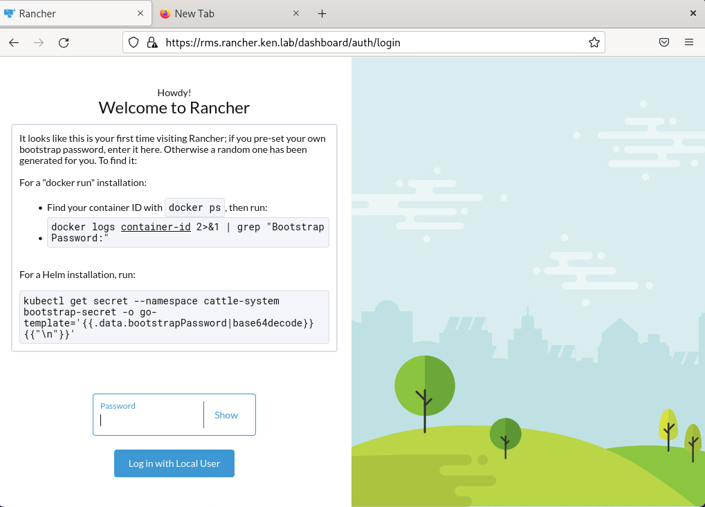

4. 登入後修改預設密碼
   admin / rancheradmin
   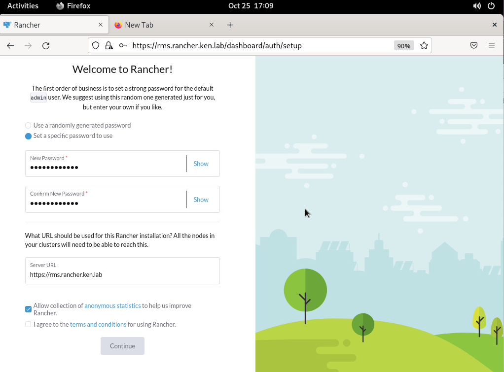

5. 登入測試
   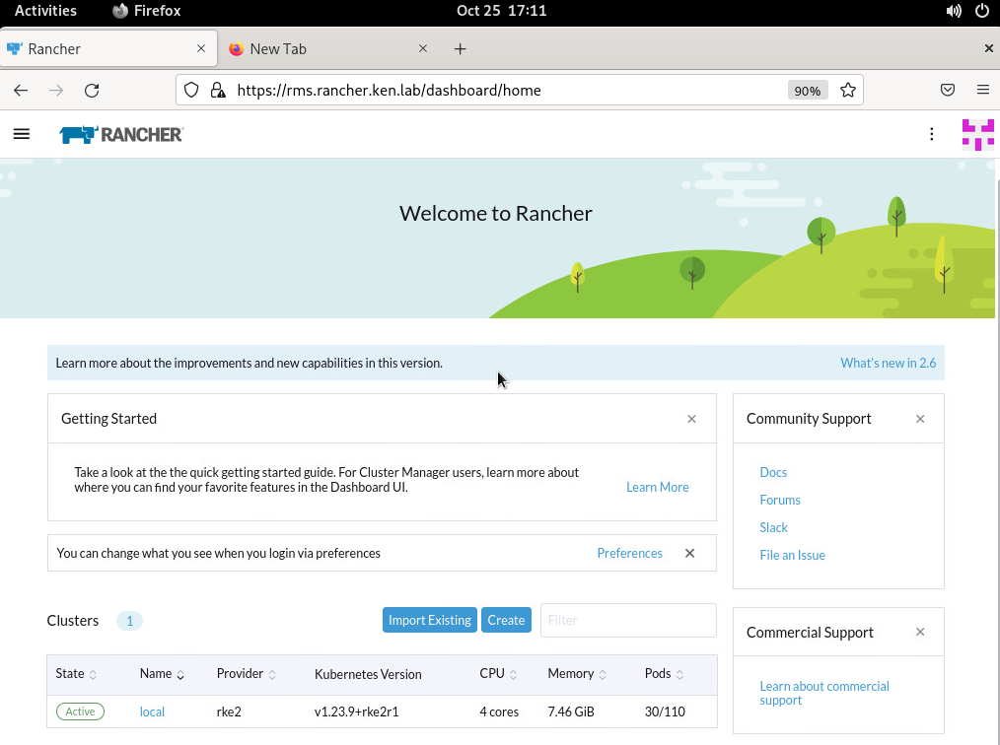

## 安裝RKE2-2 

1. 安裝OS
2. 調整DNS 指向192.168.33.40
3. 關閉防火牆

### 安裝RKE2

1. 下載install.sh 

   ```
   devop@rke2-2:~> curl -sfL https://get.rke2.io --output install.sh
   devop@rke2-2:~> chmod +x install.sh
   ```

2. 新增設定檔

   ```
   devop@rke2-2:~> sudo mkdir -p /etc/rancher/rke2/
   [sudo] root 的密碼：
   devop@rke2-2:~> sudo vim /etc/rancher/rke2/config.yaml
   server: https://rms.rancher.ken.lab:9345
   node-name:
     - "rke2-2"
   token: my-shared-secret
   tls-san:
     - rms.rancher.ken.lab
   ```

3. 安裝rke2

   ```
   devop@rke2-2:~> sudo INSTALL_RKE2_CHANNEL=v1.23.9+rke2r1 ./install.sh
   ```

4. 啟動服務

   ```
   devop@rke2-2:~> export PATH=$PATH:/opt/rke2/bin
   devop@rke2-2:~> sudo systemctl enable rke2-server --now
   Created symlink /etc/systemd/system/multi-user.target.wants/rke2-server.service → /etc/systemd/system/rke2-server.service.
   
   devop@rke2-2:~> systemctl status rke2-server.service
   ● rke2-server.service - Rancher Kubernetes Engine v2 (server)
        Loaded: loaded (/etc/systemd/system/rke2-server.service; enabled; vendor preset: disabled)
        Active: active (running) since Tue 2022-10-25 17:53:05 CST; 17min ago
          Docs: https://github.com/rancher/rke2#readme
       Process: 5602 ExecStartPre=/bin/sh -xc ! /usr/bin/systemctl is-enabled --quiet nm-cloud-setup.service (code=exited, status=0/SUCCESS)
       Process: 5604 ExecStartPre=/sbin/modprobe br_netfilter (code=exited, status=0/SUCCESS)
       Process: 5605 ExecStartPre=/sbin/modprobe overlay (code=exited, status=0/SUCCESS)
      Main PID: 5606 (rke2)
         Tasks: 148
   
   ```

5. 切換到RMS 確認nodes狀態

   ```
   devop@rms:~> kubectl get nodes
   NAME     STATUS   ROLES                       AGE   VERSION
   rke2-1   Ready    control-plane,etcd,master   81m   v1.23.9+rke2r1
   rke2-2   Ready    control-plane,etcd,master   17m   v1.23.9+rke2r1
   ```

## 安裝RKE 2-3

1. 安裝OS
2. 調整DNS 指向192.168.33.40
3. 關閉防火牆

### 安裝RKE2

1. 下載install.sh 

   ```
   devop@rke2-3:~> curl -sfL https://get.rke2.io --output install.sh
   devop@rke2-3:~> chmod +x install.sh
   ```

2. 新增設定檔

   ```
   devop@rke2-3:~> sudo mkdir -p /etc/rancher/rke2/
   [sudo] root 的密碼：
   devop@rke2-3:~> sudo vim /etc/rancher/rke2/config.yaml
   server: https://rms.rancher.ken.lab:9345
   node-name:
     - "rke2-3"
   token: my-shared-secret
   tls-san:
     - rms.rancher.ken.lab
   ```

3. 安裝rke2

   ```
   devop@rke2-3:~> sudo INSTALL_RKE2_CHANNEL=v1.23.9+rke2r1 ./install.sh
   [WARN]  /usr/local is read-only or a mount point; installing to /opt/rke2
   [INFO]  finding release for channel v1.23.9+rke2r1
   [INFO]  using v1.23.9+rke2r1 as release
   [INFO]  downloading checksums at https://github.com/rancher/rke2/releases/download/v1.23.9+rke2r1/sha256sum-amd64.txt
   [INFO]  downloading tarball at https://github.com/rancher/rke2/releases/download/v1.23.9+rke2r1/rke2.linux-amd64.tar.gz
   [INFO]  verifying tarball
   [INFO]  unpacking tarball file to /opt/rke2
   [INFO]  updating tarball contents to reflect install path
   [INFO]  moving systemd units to /etc/systemd/system
   [INFO]  install complete; you may want to run:  export PATH=$PATH:/opt/rke2/bin
   ```

4. 啟動服務

   ```
   devop@rke2-3:~> export PATH=$PATH:/opt/rke2/bin
   devop@rke2-3:~> sudo systemctl enable rke2-server --now
   ```

5. 切換到RMS 確認Nodes

   ```
   devop@rms:~> kubectl get nodes
   NAME     STATUS   ROLES                       AGE   VERSION
   rke2-1   Ready    control-plane,etcd,master   91m   v1.23.9+rke2r1
   rke2-2   Ready    control-plane,etcd,master   27m   v1.23.9+rke2r1
   rke2-3   Ready    control-plane,etcd,master   58s   v1.23.9+rke2r1
   ```

   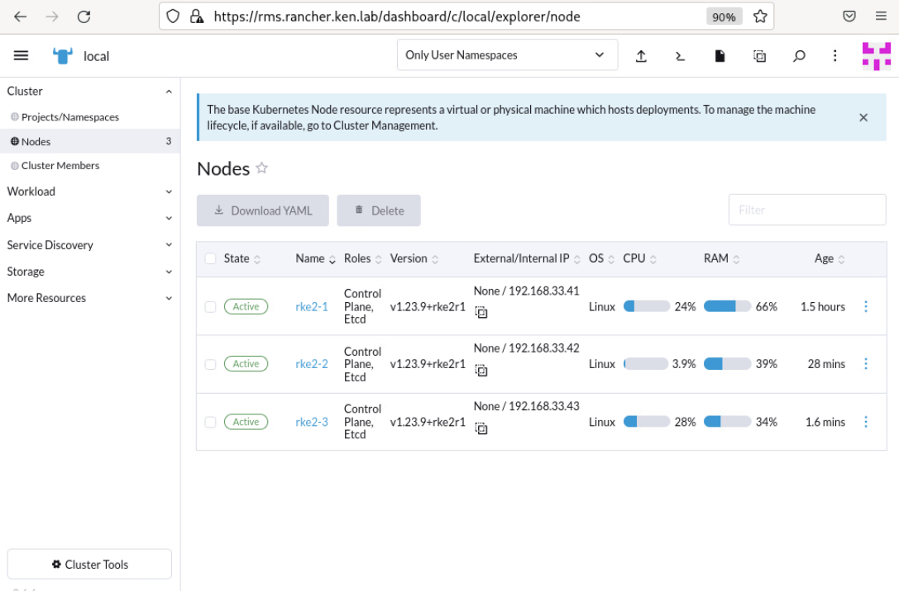


# 新增Down Stream K8s

## 架構 建議用v1.24以上


## 作業系統與安裝Dokcer

要關閉防火牆、安裝Docker (用RKE2 不用安裝Docker)

```
需先註冊系統或是設定repo

devop@master01:~> sudo SUSEConnect -p sle-module-containers/15.4/x86_64
Registering system to SUSE Customer Center

Updating system details on https://scc.suse.com ...

Activating sle-module-containers 15.4 x86_64 ...
-> Adding service to system ...
-> Installing release package ...

Successfully registered system

---

devop@master01:~> sudo zypper -n install docker
正在重新整理服務 'Basesystem_Module_15_SP4_x86_64'。
正在重新整理服務 'Containers_Module_15_SP4_x86_64'。
正在重新整理服務 'SUSE_Linux_Enterprise_Server_15_SP4_x86_64'。
正在重新整理服務 'Server_Applications_Module_15_SP4_x86_64'。
正在載入套件庫資料...
正在讀取已安裝的套件...
正在解決套件相依性...

下列 1 個推薦的套件已自動被選取：
  git-core

將會安裝下列 7 個新的套件：
  catatonit containerd docker docker-bash-completion git-core libsha1detectcoll1 runc

7 要安裝的新套件.
全部下載大小：52.2 MiB。已快取：0 B。 完成操作後，將使用額外的 242.1 MiB。
要繼續嗎？ [y/n/v/...? 顯示所有選項] (y): y
正在取出 套件 libsha1detectcoll1-1.0.3-2.18.x86_64                (1/7),  23.2 KiB (已解開  45.8 KiB)
正在取回︰ libsha1detectcoll1-1.0.3-2.18.x86_64.rpm ...........................................[完成]
正在取出 套件 catatonit-0.1.5-3.3.2.x86_64                        (2/7), 257.2 KiB (已解開 696.5 KiB)
正在取回︰ catatonit-0.1.5-3.3.2.x86_64.rpm ...................................................[完成]
正在取出 套件 runc-1.1.4-150000.33.4.x86_64                       (3/7),   2.6 MiB (已解開   9.1 MiB)
正在取回︰ runc-1.1.4-150000.33.4.x86_64.rpm ....................................[完成 (288.0 KiB/s)]
正在取出 套件 containerd-1.6.6-150000.73.2.x86_64                 (4/7),  17.7 MiB (已解開  74.2 MiB)
正在取回︰ containerd-1.6.6-150000.73.2.x86_64.rpm ................................[完成 (3.6 MiB/s)]
正在取出 套件 git-core-2.35.3-150300.10.15.1.x86_64               (5/7),   4.8 MiB (已解開  26.6 MiB)
正在取回︰ git-core-2.35.3-150300.10.15.1.x86_64.rpm ..........................................[完成]
正在取出 套件 docker-20.10.17_ce-150000.166.1.x86_64              (6/7),  26.6 MiB (已解開 131.4 MiB)
正在取回︰ docker-20.10.17_ce-150000.166.1.x86_64.rpm .............................[完成 (7.9 MiB/s)]
正在取出 套件 docker-bash-completion-20.10.17_ce-150000.166.1.noarch
                                                                  (7/7), 121.3 KiB (已解開 113.6 KiB)
正在取回︰ docker-bash-completion-20.10.17_ce-150000.166.1.noarch.rpm .........................[完成]

正在檢查檔案衝突： ............................................................................[完成]
(1/7) 正在安裝：libsha1detectcoll1-1.0.3-2.18.x86_64 ..........................................[完成]
(2/7) 正在安裝：catatonit-0.1.5-3.3.2.x86_64 ..................................................[完成]
(3/7) 正在安裝：runc-1.1.4-150000.33.4.x86_64 .................................................[完成]
(4/7) 正在安裝：containerd-1.6.6-150000.73.2.x86_64 ...........................................[完成]
(5/7) 正在安裝：git-core-2.35.3-150300.10.15.1.x86_64 .........................................[完成]
Updating /etc/sysconfig/docker ...
(6/7) 正在安裝：docker-20.10.17_ce-150000.166.1.x86_64 ........................................[完成]
(7/7) 正在安裝：docker-bash-completion-20.10.17_ce-150000.166.1.noarch ........................[完成]

--- 啟動服務

devop@master01:~> sudo systemctl enable docker --now
Created symlink /etc/systemd/system/multi-user.target.wants/docker.service → /usr/lib/systemd/system/docker.service.

```


## 從Rancher管理介面新增Cluster

1. 點選Create
   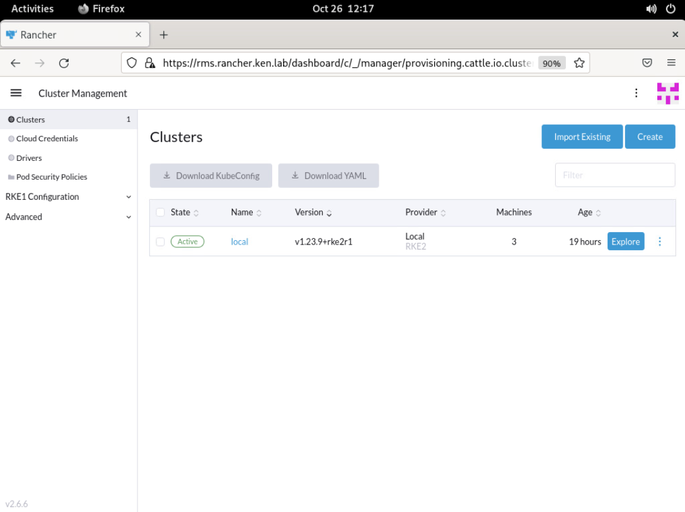
   
2. 選擇Custom 要把RKE2的選項打勾 才可以選擇RKE2
   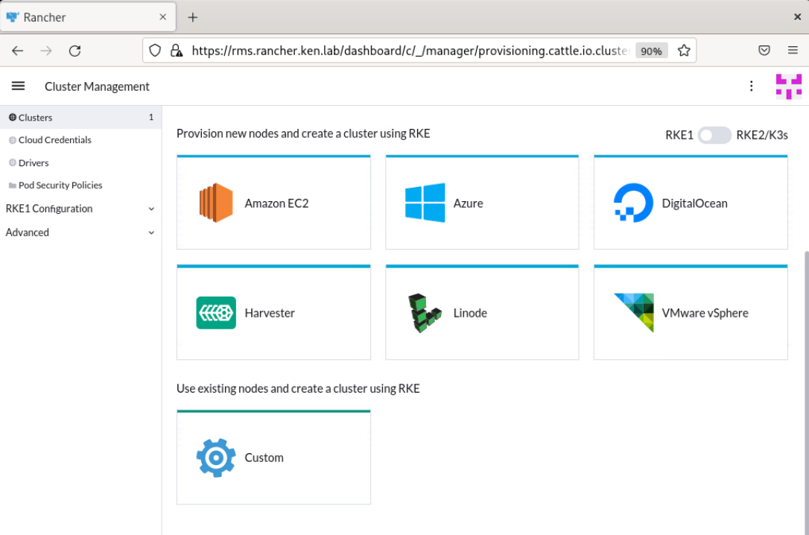
   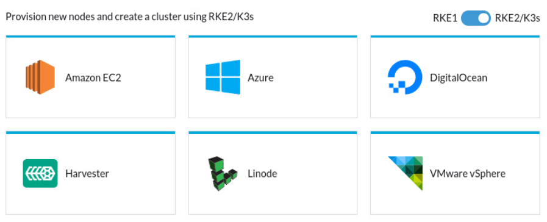
   
3. 建立名稱: DownStreamK8S ，其他Default即可
   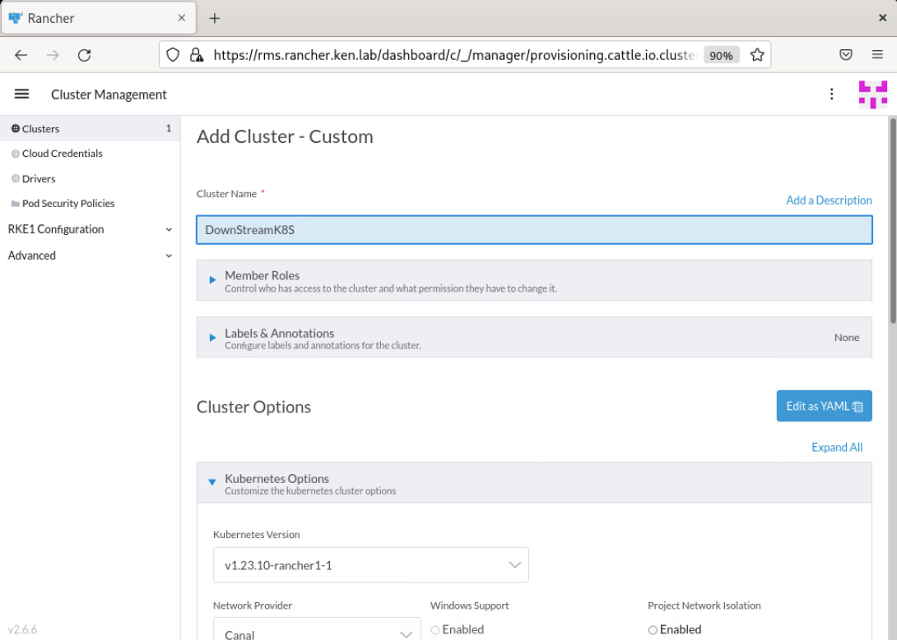
   
4. 針對各Node選擇不同的指令-Master
   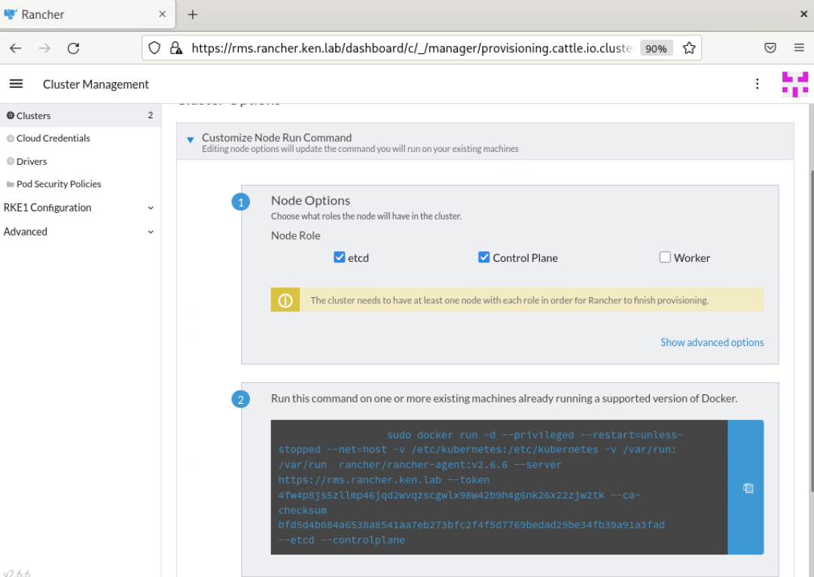
   
5. 直接貼在Master01、Master02、Ｍaster03上
   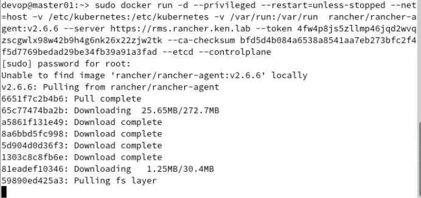
   
6. 針對各Node選擇不同的指令-Master
   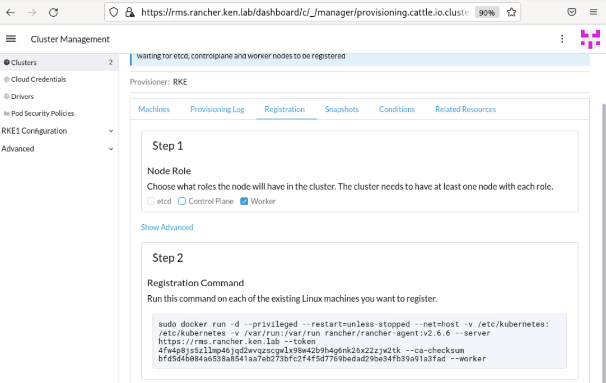
   
7. 直接貼在Woker01、Worker02
   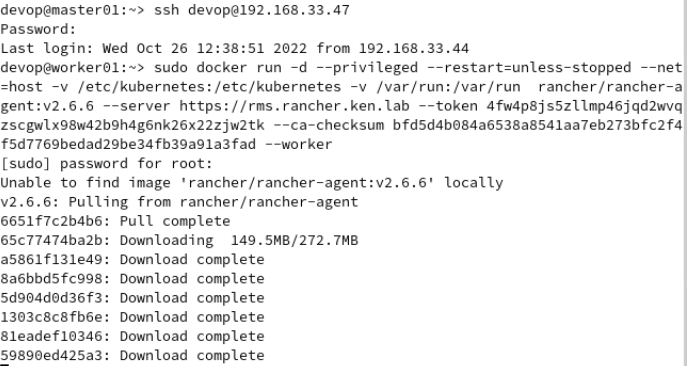
   
8. 查看Log
   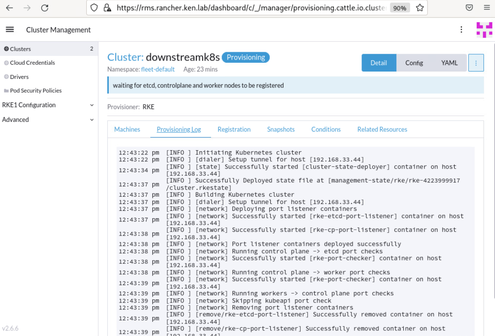
   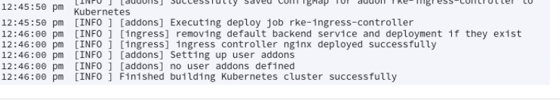
   
9. 查看Cluster狀態
   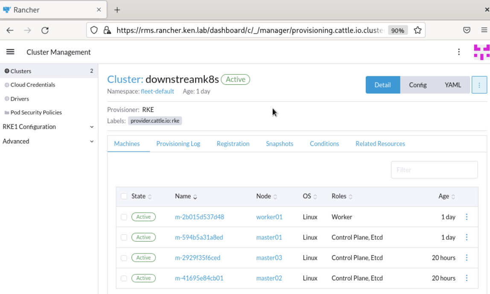
   
   


